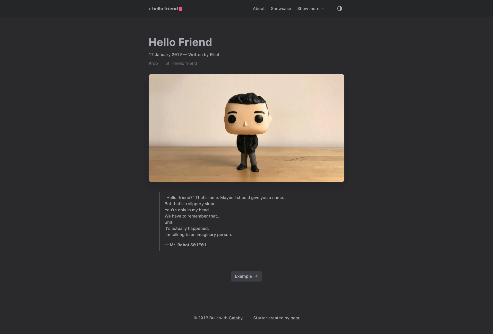

# Hello Friend



### DEMO - https://gatsby-hello-friend.now.sh/

<a href="https://www.buymeacoffee.com/panr" target="_blank"></a>

## Features

- **dark/light mode**, depending on your preferences (dark is default, but you can change it)
- great reading experience thanks to [**Inter UI font**](https://rsms.me/inter/), made by [Rasmus Andersson](https://rsms.me/about/)
- nice code highlighting thanks to [**PrismJS**](https://prismjs.com)
- responsive YouTube/Vimeo/etc. videos [gatsby-remark-embed-video](https://github.com/borgfriend/gatsby-remark-embed-video)
- fully responsive site

### Code highlighting

Hello Friend uses PrismJS to highlight your code. All you need to do is to wrap your code like this:

<pre>
```html
// your code here
```
</pre>

#### Supported languages

bash/shell, css, clike, javascript, apacheconf, actionscript, applescript, c, csharp, cpp, coffeescript, ruby, csp, css-extras, diff, django, docker, elixir, elm, markup-templating, erlang, fsharp, flow, git, go, graphql, less, handlebars, haskell, http, java, json, kotlin, latex, markdown, makefile, objectivec, ocaml, perl, php, php-extras, r, sql, processing, scss, python, jsx, typescript, toml, reason, textile, rust, sass, stylus, scheme, pug, swift, yaml, haml, twig, tsx, vim, visual-basic, wasm.

## How to start

Clone the repo and install the dependencies:

```bash
git clone https://github.com/panr/gatsby-starter-hello-friend.git
cd gatsby-starter-hello-friend
yarn
```

To run the starter in development mode:

```bash
yarn dev  # gatsby clean && gatsby develop
```

To build and run the starter in production mode:

```bash
yarn build  # gatsby clean && gatsby build
yarn serve
```

## How it works

It's a simple starter for blogs and personal sites. You have `posts` and `pages` directories. Posts are generated from markdown files with required fields: `title`, `date` and `path`. Pages can be generated from markdown files as well (with built-in navigation between them, just like in posts), but you can also generate them from JavaScript files (just like you normally do in Gatsby). If so, you should wrap your content with the `Layout` component. It's not required, but highly recommended.

### Configuration

You can configure the starter in `gatsby-config.js`. Here's what you can change:

```js
title: String,
description: String,
copyrights: String,
author: String,
logo: Shape { // you can place your own logo
  src: String, // default dir is `/static/`
  alt: String,
},
logoText: String, // change default Hello Friend logo
defaultTheme: String, // light or dark as default
postsPerPage: Number, // pagination
showMenuItems: Number, // number of visible main menu items
menuMoreText: String, // string of main sub menu trigger (not visible items from main menu)
mainMenu: arrayOf(Shape { // main menu items
  title: String,
  path: String,
})
```

## How to contribute

If you spot any bugs, please use [Issue Tracker](https://github.com/panr/gatsby-starter-hello-friend/issues) or if you want to add a new feature directly please create a new [Pull Request](https://github.com/panr/gatsby-starter-hello-friend/pulls).

## Sponsoring

If you like my work and want to support the development of the project, now you can! Just:

<a href="https://www.buymeacoffee.com/panr" target="_blank"></a>

## License

This starter is released under the [MIT License](./LICENSE).
